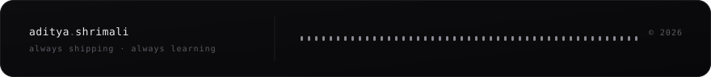

<!--
═══════════════════════════════════════════════════════════════
  ADITYA SHRIMALI · GITHUB PROFILE README
  Theme: "Architectural Light" — bone-white · ink · emerald accent
  Hand-built animated SVGs + light-themed stat services
  Swap `just-brainwaves` for your username if you fork this.
═══════════════════════════════════════════════════════════════
-->

<!-- ============================ HERO ============================ -->
<div align="center">

  

  <br/>

  <!-- typing tagline (emerald, light) -->
  <a href="https://github.com/just-brainwaves">
    
  </a>

  <br/><br/>

  <!-- live badges (flat, light, emerald) -->
  
  
  
  

</div>

<!-- ============================ BOOT LOG ============================ -->
<div align="center">

  <br/>
  

</div>


<!-- ============================ ABOUT ============================ -->
<h2 align="center"><code>&gt; cat ./about.md</code></h2>

<table align="center" border="0">
<tr>
<td width="56%" valign="top">

```yaml
profile:
  name:     "Aditya Shrimali"
  alias:    "@just-brainwaves"
  class:    AI Engineer / LLM Whisperer
  origin:   India   # UTC+5:30

specialization:
  - Generative AI & LLM systems
  - Retrieval-Augmented Generation (RAG)
  - Agentic architectures & workflows
  - Microservice integrations @ scale

currently:
  building:  "Kyren"
  learning:  "Agentic AI"   # the obsession arc
  fueled_by: [caffeine, stack_traces, vector_math]

reach_me:
  email:    aditya.shrimali.dev@gmail.com
  fun_fact: "I name my variables better than my pets"
```

</td>
<td width="44%" valign="top" align="center">

  <br/>

  <!-- rotating dev quote, light theme -->
  

  <br/><br/>

  
  <br/>
  

</td>
</tr>
</table>


<!-- ============================ ARSENAL ============================ -->
<h2 align="center"><code>&gt; ./load_arsenal.sh</code></h2>

<div align="center">

<table border="0">
<tr><td align="center">

**AI / ML**
<br/>

<br/>


</td></tr>
<tr><td align="center">

**Languages & Backend**
<br/>


</td></tr>
<tr><td align="center">

**Data & Infrastructure**
<br/>

<br/>


</td></tr>
<tr><td align="center">

**Frontend & Tooling**
<br/>


</td></tr>
</table>

</div>


<!-- ============================ STATS ============================ -->
<h2 align="center"><code>&gt; htop --user=just-brainwaves</code></h2>

<div align="center">

  
  

  <br/>

  
  

  <br/><br/>

  

</div>


<!-- ============================ SIGNATURE / MATRIX ============================ -->
<div align="center">

  

</div>


<!-- ============================ PROJECTS ============================ -->
<h2 align="center"><code>&gt; ls ./projects/</code></h2>

<div align="center">

  <a href="https://github.com/just-brainwaves/kyren">
    
  </a>
  <a href="https://github.com/just-brainwaves?tab=repositories">
    
  </a>

</div>

<table align="center">
<tr>
<td width="50%" valign="top">

#### `[01]` &nbsp; Kyren
> Current obsession. An agentic AI system exploring autonomous, workflow-driven reasoning.

`Python` · `LLMs` · `Agents` · `RAG`

[`→ explore`](https://github.com/just-brainwaves/kyren)

</td>
<td width="50%" valign="top">

#### `[02]` &nbsp; Your Next Build
> Swap this card in for any repo — RAG pipeline, chatbot, or vector search engine.

`add` · `your` · `stack` · `here`

[`→ explore`](https://github.com/just-brainwaves?tab=repositories)

</td>
</tr>
</table>


<!-- ============================ SNAKE ============================ -->
<h2 align="center"><code>&gt; ./contribution_snake --eat-the-grid</code></h2>

<div align="center">
  <picture>
    <source media="(prefers-color-scheme: dark)" srcset="https://raw.githubusercontent.com/just-brainwaves/just-brainwaves/output/github-contribution-grid-snake-dark.svg"/>
    <source media="(prefers-color-scheme: light)" srcset="https://raw.githubusercontent.com/just-brainwaves/just-brainwaves/output/github-contribution-grid-snake.svg"/>
    
  </picture>
</div>


<!-- ============================ CONNECT ============================ -->
<h2 align="center"><code>&gt; ping aditya --connect</code></h2>

<div align="center">

  <a href="mailto:aditya.shrimali.dev@gmail.com">
    
  </a>
  <a href="https://instagram.com/aditya._shrimali">
    
  </a>
  <a href="https://leetcode.com/dev-adi">
    
  </a>
  <a href="https://github.com/just-brainwaves">
    
  </a>

</div>

<br/>

<!-- ============================ FOOTER ============================ -->
<div align="center">

  

  <sub><code>// if you read the HTML comments too, we'd get along.</code></sub>

</div>
