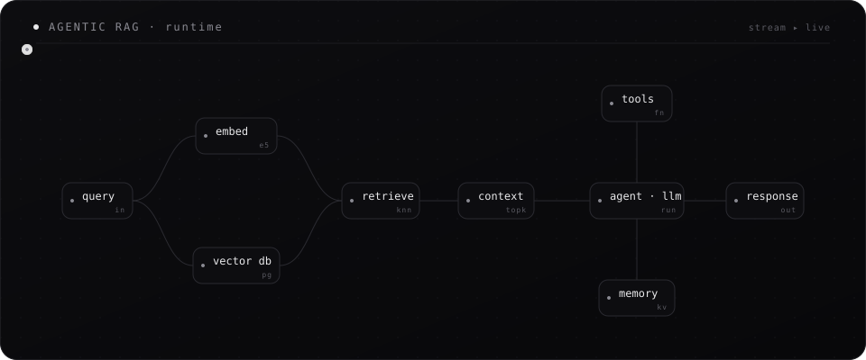

<!-- agentic rag architecture — live data flow -->

<!-- latent space — rotating wireframe -->

<!-- stack -->

<!-- projects — live, deployed sites (cards are clickable) -->
<h3 align="center">⟡ &nbsp;Selected Work &nbsp;·&nbsp; <em>live & deployed</em> &nbsp;⟡</h3>

  
  &nbsp;
  

  
  &nbsp;
  

  
  
  
  

<!-- stats -->

  
  &nbsp;
  

<!-- snake (auto-generated by .github/workflows/snake.yml) -->
<picture>
  <source media="(prefers-color-scheme: dark)" srcset="https://raw.githubusercontent.com/just-brainwaves/just-brainwaves/output/github-contribution-grid-snake-dark.svg" />
  <source media="(prefers-color-scheme: light)" srcset="https://raw.githubusercontent.com/just-brainwaves/just-brainwaves/output/github-contribution-grid-snake.svg" />
  
</picture>

<!-- footer -->

  <a href="mailto:aditya.shrimali.dev@gmail.com">email</a> &nbsp;·&nbsp;
  <a href="https://github.com/just-brainwaves">github</a> &nbsp;·&nbsp;
  <a href="https://instagram.com/aditya._shrimali">instagram</a> &nbsp;·&nbsp;
  <a href="https://leetcode.com/dev-adi">leetcode</a>

