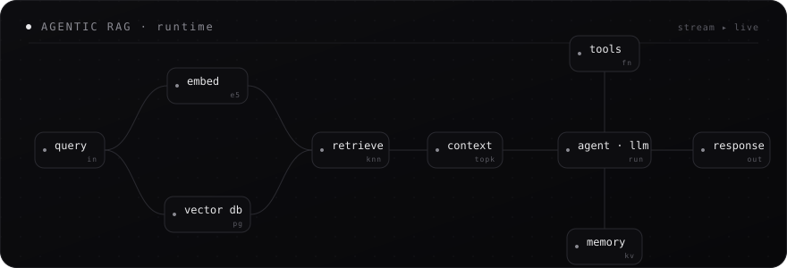

<!--
═══════════════════════════════════════════════════════════════
  ADITYA SHRIMALI · GITHUB PROFILE README
  Theme: "Architectural Dark" — ink-black · slate · emerald accent
  Hand-built animated SVGs + dark-themed stat services
  Swap `just-brainwaves` for your username if you fork this.
═══════════════════════════════════════════════════════════════
-->

<!-- ============================ HERO ============================ -->
<div align="center">

  

  <br/>

  <!-- typing tagline (emerald, dark) -->
  <a href="https://github.com/just-brainwaves">
    
  </a>

  <br/><br/>

  <!-- live badges (flat, dark, emerald) -->
  
  
  
  

  <br/><br/>

  <!-- signature visual: how I think about systems -->
  

</div>


<!-- ============================ ABOUT ============================ -->
<h3 align="center">About</h3>

<table align="center"><tr><td>

```yaml
profile:
  name:     "Aditya Shrimali"
  alias:    "@just-brainwaves"
  class:    AI Engineer / LLM Whisperer
  origin:   India   # UTC+5:30

specialization:
  - Generative AI & LLM systems
  - Retrieval-Augmented Generation (RAG)
  - Agentic architectures & workflows
  - Microservice integrations @ scale

currently:
  building:  "Kyren"
  learning:  "Agentic AI"   # the obsession arc
  fueled_by: [caffeine, stack_traces, vector_math]

reach_me:
  email:    aditya.shrimali.dev@gmail.com
  fun_fact: "I name my variables better than my pets"
```

</td></tr></table>

<div align="center">

  <br/>

  

  <br/><br/>

  
  

</div>


<!-- ============================ TECH STACK ============================ -->
<h3 align="center">Tech Stack</h3>

<div align="center">

<table border="0">
<tr><td align="center">

**AI / ML**
<br/>

<br/>


</td></tr>
<tr><td align="center">

**Languages & Backend**
<br/>


</td></tr>
<tr><td align="center">

**Data & Infrastructure**
<br/>

<br/>


</td></tr>
<tr><td align="center">

**Frontend & Tooling**
<br/>


</td></tr>
</table>

</div>


<!-- ============================ GITHUB ACTIVITY ============================ -->
<h3 align="center">GitHub Activity</h3>

<div align="center">

  
  

  <br/>

  

  <br/><br/>

  

</div>


<!-- ============================ PROJECTS ============================ -->
<h3 align="center">Projects</h3>

<div align="center">

  <a href="https://github.com/just-brainwaves/moonshrine">
    
  </a>

</div>

<table align="center">
<tr>
<td width="50%" valign="top">

#### Moonshrine
> An opinionated Arch + Hyprland setup on CachyOS for developers who like efficiency — dark to the point of disappearing, with a scarlet accent that bleeds through every active state.

`Hyprland` · `CachyOS` · `dotfiles` · `ricing`

[→ explore](https://github.com/just-brainwaves/moonshrine)

</td>
<td width="50%" valign="top">

#### Your Next Build
> Swap this card in for any repo — RAG pipeline, chatbot, or vector search engine.

`add` · `your` · `stack` · `here`

[→ explore](https://github.com/just-brainwaves?tab=repositories)

</td>
</tr>
</table>


<!-- ============================ CONTRIBUTION GRAPH ============================ -->
<h3 align="center">Contribution Graph</h3>

<div align="center">
  <picture>
    <source media="(prefers-color-scheme: dark)" srcset="https://raw.githubusercontent.com/just-brainwaves/just-brainwaves/output/github-contribution-grid-snake-dark.svg"/>
    <source media="(prefers-color-scheme: light)" srcset="https://raw.githubusercontent.com/just-brainwaves/just-brainwaves/output/github-contribution-grid-snake.svg"/>
    
  </picture>
</div>


<!-- ============================ CONNECT ============================ -->
<h3 align="center">Connect</h3>

<div align="center">

  <a href="mailto:aditya.shrimali.dev@gmail.com">
    
  </a>
  <a href="https://instagram.com/aditya._shrimali">
    
  </a>
  <a href="https://leetcode.com/dev-adi">
    
  </a>
  <a href="https://github.com/just-brainwaves">
    
  </a>

</div>

<br/>

<!-- ============================ FOOTER ============================ -->
<div align="center">

  

  <sub><code>// if you read the HTML comments too, we'd get along.</code></sub>

</div>
